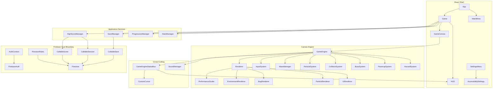

# BUGSMASHER — System Architecture

**Current truth:** This document describes the intended current architecture. Historical verification documents may describe older implementations.

## High-Level Diagram



## Dependency direction

```text
React UI
  ↓
Application/game orchestration
  ↓
Game systems + infrastructure adapters
  ↓
External services (Firebase, browser APIs)
```

Lower layers must not import React presentation concerns. Rendering code must not own business rules. Security decisions must not depend on client-only checks.

## Game Loop

1. `requestAnimationFrame` → `GameEngine.loop(dt)`
2. `update(dt)` → input, systems, wave progression, collisions and gameplay state
3. `Renderer.draw()` → environment, particles, entities and visual overlays
4. `GameEngineStatusBus.publish()` → React HUD/cursor consumers

**Invariant:** gameplay timing uses delta-time (`dt`) in seconds. Do not introduce `setTimeout` or `setInterval` for gameplay state progression.

## Module Boundaries

| Module | Responsibility | Must NOT |
|---|---|---|
| `GameEngine` | orchestration, lifecycle, session state | own detailed boss AI, draw primitives, persistence/security rules |
| `WaveManager` | spawn pacing, wave/boss scheduling | resolve collisions or render UI |
| `CollisionSystem` | hit detection and damage routing | own React/UI or Firebase writes |
| `Renderer` | draw order, camera/performance coordination | define gameplay rules or persistence |
| `*Renderer.ts` | specialized canvas rendering | own score/progression/security |
| React components | interaction and presentation | become authoritative game-state/security stores |
| callable functions | server-side authorization/validation | trust client claims without validation |
| Firestore rules | database-level authorization constraints | encode large application workflows |

## Data Flow — Cloud Saves

```text
GameSaveData
   ↓
client checksum / local persistence
   ↓
Firebase callable
   ↓
auth + schema validation + server checksum
   ↓
Firestore
```

Client checksums help detect corruption and provide integrity metadata. They are not a trust boundary.

## Data Flow — Competitive Score Submission

```text
Authenticated user
   ↓
startSession callable
   ↓
server-generated, user-bound, expiring session token
   ↓
play session
   ↓
submitScore callable
   ↓
verify session + expiry + one-time consumption + plausibility + rate limit
   ↓
monotonic leaderboard update
```

The current session mechanism is a strong nonce/session control. It is not a claim of mathematically complete replay prevention. A future signed/deterministic run-verification layer is tracked on the live taskboard.

## Security invariants

- Unauthenticated users cannot perform authoritative save/score operations.
- Direct client writes to protected authoritative collections are denied by Firestore rules.
- Score submission requires a server-issued session token.
- Session tokens are bound to the authenticated user, expire, and are consumed once.
- Server-side plausibility checks reject impossible score rates.
- Rate limits are enforced server-side.

## Key files

| Path | Purpose |
|---|---|
| `src/game/GameEngine.ts` | session orchestrator |
| `src/game/GameTypes.ts` | core entity/data contracts |
| `src/game/GameConfig.ts` | balance and gameplay constants |
| `src/game/rendering/*` | canvas rendering specialists |
| `src/lib/firebaseService.ts` | client Firebase/application adapter |
| `functions/src/handlers.ts` | callable server handlers |
| `functions/src/sessionToken.ts` | score-session security primitives |
| `firestore.rules` | database trust boundary |

## Architecture decision rule

Before introducing a new global manager, browser `window` bridge, direct Firebase write, or large cross-layer dependency, record the reason and expected lifetime in an ADR. Prefer explicit interfaces and dependency injection for reusable services.