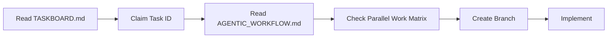

# BUGSMASHER — The 10/10 Blueprint (Single Source of Truth)

> **Version:** 1.0.0  
> **Last Updated:** 2026-07-06  
> **Current Honest Rating:** 7.1/10  
> **Target:** Verified 10/10 Production-Ready Showcase  
> **Strategy:** Brutal honesty, evidence-based gates, iterative sprints, zero stubs marked complete

---

## Table of Contents

1. [Executive Summary](#1-executive-summary)
2. [Definition of 10/10](#2-definition-of-1010)
3. [Current State Assessment](#3-current-state-assessment)
4. [The 10 Pillars Framework](#4-the-10-pillars-framework)
   - [Pillar 1: Code Quality & Structure](#pillar-1-code-quality--structure)
   - [Pillar 2: Test Coverage & Reliability](#pillar-2-test-coverage--reliability)
   - [Pillar 3: Security & Data Integrity](#pillar-3-security--data-integrity)
   - [Pillar 4: Architecture & Modularity](#pillar-4-architecture--modularity)
   - [Pillar 5: Documentation](#pillar-5-documentation)
   - [Pillar 6: CI/CD & Tooling](#pillar-6-cicd--tooling)
   - [Pillar 7: Git Hygiene & Branch Strategy](#pillar-7-git-hygiene--branch-strategy)
   - [Pillar 8: Deployment & Operations](#pillar-8-deployment--operations)
   - [Pillar 9: Performance & Scalability](#pillar-9-performance--scalability)
   - [Pillar 10: Business & Product Alignment](#pillar-10-business--product-alignment)
5. [Phase-by-Phase Execution Plan](#5-phase-by-phase-execution-plan)
   - [Sprint 0: Truth & Foundation (Week 1)](#sprint-0-truth--foundation-week-1)
   - [Sprint 1: Security Hardening (Week 2)](#sprint-1-security-hardening-week-2)
   - [Sprint 2: Coverage Recovery (Week 3)](#sprint-2-coverage-recovery-week-3)
   - [Sprint 3: Tooling & Standards (Week 4)](#sprint-3-tooling--standards-week-4)
   - [Sprint 4: Architecture Sprint (Week 5-6)](#sprint-4-architecture-sprint-week-5-6)
   - [Sprint 5: Visual & UX Sprint (Week 7-8)](#sprint-5-visual--ux-sprint-week-7-8)
   - [Sprint 6: Production Readiness (Week 9-10)](#sprint-6-production-readiness-week-9-10)
   - [Sprint 7: Polish & Launch (Week 11-12)](#sprint-7-polish--launch-week-11-12)
6. [Technical Architecture Standards](#6-technical-architecture-standards)
7. [Developer/Agent Workflow](#7-developeragent-workflow)
8. [Quality Gates & Verification Protocol](#8-quality-gates--verification-protocol)
9. [Incident Response & Rollback](#9-incident-response--rollback)
10. [Appendices](#10-appendices)

---

## 1. Executive Summary

**BugSmasher** is a high-intensity, FAANG-level React/TypeScript game engine using Canvas 2D with Firebase backend. It features Brutalist OS aesthetics vs. bio-luminescent bugs, 507+ passing tests, server-authoritative save/score paths, and comprehensive CI/CD.

The project has strong foundations but is held back by:

- **Build broken** (Tailwind native binding issue)
- **ESLint non-functional** (config format mismatch)
- **Coverage targets not met** (77% lines vs 80% target)
- **Session-token anti-cheat missing** (P0 security gap)
- **Production stubs** (ads, monetization, monitoring not real)
- **Architecture debt** (GameEngine 1,084 lines, SoundManager 1,529 lines)
- **Stale documentation** claiming false 10/10 readiness

This blueprint is the **single source of truth** for closing every gap. It provides actionable, granular tasks organized by sprint, with clear acceptance criteria, quality gates, and verification protocols. Every claim must be backed by command evidence — no stub marked complete, no doc inflation.

---

## 2. Definition of 10/10

A verified 10/10 means **every dimension below** is at 9+ with documented, tool-verified evidence:

| Dimension          | 10/10 Gate                                                                                    | Verification Method                              |
| ------------------ | --------------------------------------------------------------------------------------------- | ------------------------------------------------ |
| **Code Quality**   | No files >800 lines. No `any` types. ESLint strict pass. TypeScript strict pass.              | `npm run lint:all`, `tsc --noEmit`, ESLint audit |
| **Test Coverage**  | 507+ tests. 80% lines, 70% branches, 75% functions, 80% statements. Playwright E2E smoke.     | `npm run test:coverage`, Playwright CI run       |
| **Security**       | Emulator-proven rules. Session anti-cheat. 0 direct client writes. Dependabot + CodeQL green. | `npm run test:emulator`, GitHub security tab     |
| **Architecture**   | GameEngine <800 lines. No static service locators. No window status bridge. Clean DI.         | Code review + `grep -r` patterns                 |
| **Documentation**  | README honest. ARCHITECTURE current. VERIFICATION evidence. ADRs for all major decisions.     | Link check, manual audit                         |
| **CI/CD**          | `npm run ci` = lint + functions + coverage + emulator + build — ALL green. ESLint in CI.      | GitHub Actions status                            |
| **Git Hygiene**    | Branch protection on. Stale branches cleaned. Conventional commits. SemVer releases.          | GitHub settings audit                            |
| **Deployment/Ops** | Build green. Crash reporting (Sentry). Monitoring (real provider). Rollback documented.       | Live site health + Sentry dashboard              |
| **Performance**    | Bundle warnings fixed. Frame-time benchmark. Lighthouse >90. PWA audit pass.                  | `npm run build` clean, Lighthouse CI             |
| **Business**       | Monetization/analytics/ads real OR explicitly de-scoped. Privacy policy. WCAG AA.             | Product acceptance doc                           |

---

## 3. Current State Assessment

### 3.1 Scorecard (Brutally Honest — July 2026)

| #   | Pillar                        | Current Score | Trend | Critical Gaps                                                                |
| --- | ----------------------------- | :-----------: | :---: | ---------------------------------------------------------------------------- |
| 1   | Code Quality & Structure      |    6.5/10     |   →   | ESLint broken, GameEngine 1,084 LOC, SoundManager 1,529 LOC, `any` in UI     |
| 2   | Test Coverage & Reliability   |    7.0/10     |   ↗   | Coverage targets not met (77/62/80/77 vs 80/70/75/80), no E2E, 0% files      |
| 3   | Security & Data Integrity     |    7.5/10     |   ↗   | Session-token anti-cheat (P0), PII in error logs, no dependency audit in CI  |
| 4   | Architecture & Modularity     |    7.0/10     |   ↗   | GameEngine god class, static managers, window bridge, circular deps          |
| 5   | Documentation                 |  **8.0/10**   |   →   | Stale 10/10 claims in FINAL_AUDIT, CTO_AUDIT contradictions, no ADRs         |
| 6   | CI/CD & Tooling               |    7.5/10     |   ↘   | **Build broken**, ESLint broken, no E2E, coverage thresholds > actual        |
| 7   | Git Hygiene & Branch Strategy |    7.5/10     |   →   | 17+ stale remote branches, no branch protection, some unprofessional commits |
| 8   | Deployment & Operations       |    6.0/10     |   ↘   | **Build broken**, monitoring/ads/monetization stubs, no Sentry DSN           |
| 9   | Performance & Scalability     |    7.0/10     |   →   | Bundle warnings, no perf benchmarks, Firebase vendor chunk large             |
| 10  | Business & Product Alignment  |    6.5/10     |   →   | Monetization/analytics/ads stubs, no privacy policy, no WCAG audit           |
|     | **OVERALL**                   |  **7.1/10**   |   →   | 5 critical P0 blockers, 8 P1 gaps, 12+ P2 improvements needed                |

### 3.2 Top 10 Blocker Items (Priority Order)

| #   | Item                                            | Pillar       | Impact                                | Estimated Effort |
| --- | ----------------------------------------------- | ------------ | ------------------------------------- | :--------------: |
| 1   | Fix build (`@tailwindcss/oxide` native binding) | CI/CD        | **Blocks all deployment**             |      30 min      |
| 2   | Fix ESLint config                               | Tooling      | **Blocks code quality automation**    |       1 hr       |
| 3   | Implement session-token anti-cheat (S-06)       | Security     | **Competitive leaderboard integrity** |     2-3 days     |
| 4   | Raise coverage to 80/70/75/80                   | Tests        | **Quality assurance baselines**       |     3-5 days     |
| 5   | Establish branch protection rules               | Git          | **Prevents bad merges**               |      30 min      |
| 6   | Replace or de-scope production stubs            | Business     | **Honest release scope**              |     2-3 days     |
| 7   | Extract CombatSystem from GameEngine            | Architecture | **Reduces god class**                 |     2-3 days     |
| 8   | ESLint strict rules (TS + React + a11y)         | Tooling      | **Static analysis quality**           |     1-2 days     |
| 9   | Playwright E2E smoke test                       | Tests        | **End-to-end verification**           |     2-3 days     |
| 10  | Clean stale branches + professionalize commits  | Git          | **Repo presentation**                 |       1 hr       |

---

## 4. The 10 Pillars Framework

### Pillar 1: Code Quality & Structure

**Target:** 9.5/10 — No files >800 lines. ESLint strict pass. TypeScript strict. No `any` types. No `@ts-nocheck`. Prettier formatting.

#### Current State

- **Total LOC:** 30,306 across 119 TypeScript/TSX files
- **Largest files:** SoundManager (1,529), BugRenderer (1,208), GameEngine (1,084), IntelHub (1,024)
- **ESLint:** Non-functional (`eslint.config.js` format mismatch)
- **`lint` script:** `tsc --noEmit` only (no actual lint rules)
- **`any` types:** Reduced but still present in UI components
- **`@ts-nocheck`:** Present in some renderers (EnvironmentRenderer, BugRenderer, ParticleRenderer, UIRenderer)

#### Action Items

| ID    | Task                                                          | Effort | Depends On | Acceptance Criteria                                           |
| ----- | ------------------------------------------------------------- | :----: | :--------: | ------------------------------------------------------------- |
| CQ-01 | Fix ESLint flat config (TS + React + a11y rules)              |  2 hr  |     —      | `npm run lint:eslint` passes with configured rules            |
| CQ-02 | Split `lint` into `typecheck` + `lint:eslint` in package.json | 30 min |   CQ-01    | `npm run lint` = ESLint + tsc; `npm run typecheck` = tsc only |
| CQ-03 | Remove `@ts-nocheck` from all renderers                       |  3 hr  |   CQ-01    | Zero `@ts-nocheck` in `src/`                                  |
| CQ-04 | Replace `any` types in UI components with proper types        |  4 hr  |   CQ-01    | `grep -r ": any" src/` returns zero                           |
| CQ-05 | SoundManager split (SFX, Music, Voice sub-modules)            |  6 hr  |     —      | Each file <600 lines; all tests pass                          |
| CQ-06 | GameEngine extract combat logic (see Architecture)            |  6 hr  |     —      | GameEngine <800 lines                                         |
| CQ-07 | IntelHub component split                                      |  4 hr  |     —      | IntelHub <400 lines                                           |
| CQ-08 | HUD component split                                           |  4 hr  |     —      | HUD <400 lines                                                |
| CQ-09 | Prettier integration (format on save config)                  | 30 min |   CQ-01    | `npm run format:check` passes                                 |
| CQ-10 | Add `lint-staged` for pre-commit formatting                   | 30 min |   CQ-09    | Husky formats staged files                                    |

**Definition of Done for Pillar 1:**

- [ ] `npm run lint:all` passes (ESLint + tsc, 0 errors, 0 warnings)
- [ ] No files exceed 800 LOC
- [ ] Zero instances of `any`, `@ts-nocheck`, `@ts-ignore`, `as any` in `src/`
- [ ] `npm run format:check` passes
- [ ] All existing tests still pass

---

### Pillar 2: Test Coverage & Reliability

**Target:** 9.5/10 — 80% lines, 70% branches, 75% functions, 80% statements. Playwright E2E smoke. Frame-time benchmark.

#### Current State

- **Tests:** 507/507 pass (28 test files)
- **Engine/lib coverage:** 77.93% lines, 61.58% branches, 80.03% functions, 76.94% statements
- **Interim thresholds:** 77% lines, 61% branches, 75% functions, 76% statements
- **Phase 2b targets:** 80% lines, 70% branches, 75% functions, 80% statements (NOT MET)
- **Worst offenders:** GameEngine (46% branch), WaveManager (47% branch), SaveManager (49% branch)
- **Zero coverage:** GameTypes.ts, ParticleEngineHost.ts, AchievementManager.ts
- **No E2E** (Playwright not configured)
- **No frame-time benchmarks**

#### Action Items

| ID   | Task                                                           | Effort |    Depends On     | Acceptance Criteria                         |
| ---- | -------------------------------------------------------------- | :----: | :---------------: | ------------------------------------------- |
| T-01 | GameEngine branch coverage: death/kill/resource edge cases     |  6 hr  |         —         | GameEngine branch ≥65%                      |
| T-02 | WaveManager branch coverage: spawn/boss/surge paths            |  4 hr  |         —         | WaveManager branch ≥65%                     |
| T-03 | SaveManager cloud path coverage: auth + error branches         |  3 hr  |         —         | SaveManager branch ≥65%                     |
| T-04 | InputSystem + GameEngineStatusBus tests                        |  3 hr  |         —         | Both >80% lines, >70% branches              |
| T-05 | ParticleEngineHost tests (0% currently)                        |  3 hr  |         —         | >80% lines                                  |
| T-06 | GameTypes.ts tests (0% currently)                              |  2 hr  |         —         | >80% lines                                  |
| T-07 | AchievementManager tests (0% currently)                        |  3 hr  |         —         | >80% lines                                  |
| T-08 | Raise vitest.config.ts thresholds to 80/70/75/80               | 30 min | T-01 through T-07 | `npm run test:coverage` passes at target    |
| T-09 | Playwright setup + smoke E2E (menu → play → pause → game over) |  6 hr  |         —         | `npx playwright test` passes in CI          |
| T-10 | Frame-time benchmark harness (scripted run, FPS budget)        |  4 hr  |         —         | Baseline FPS recorded; regression detection |
| T-11 | Functions test coverage >80%                                   |  3 hr  |         —         | `vitest run --coverage` for functions       |
| T-12 | Fix date-sensitive tests to use `vi.setSystemTime`             |  2 hr  |         —         | No timezone brittleness                     |

#### Test Writing Guidelines

```
- Engine systems: Test state transitions, edge cases, error paths (not just happy path)
- UI components: Test render + interaction + accessibility (not visual snapshots)
- Firebase/lib: Test with mocks AND emulator (dual verification)
- Game logic: Use known seeds for deterministic tests (no Math.random in test assertions)
- Performance: Use `vi.advanceTimersByTime` for frame-accurate simulation
```

**Definition of Done for Pillar 2:**

- [ ] `npm run test:coverage` passes at 80/70/75/80 thresholds
- [ ] All files in `src/game/` and `src/lib/` have >70% branch coverage
- [ ] Playwright E2E smoke test passes in CI
- [ ] Frame-time benchmark recorded and baseline tracked
- [ ] Functions tests >80% coverage

---

### Pillar 3: Security & Data Integrity

**Target:** 9.5/10 — Emulator-proven trust boundaries. Session anti-cheat. 0 direct client writes. Dependabot + CodeQL green. Security.md published.

#### Current State

- ✅ Firestore rules deny direct client saves/leaderboard writes
- ✅ Callable functions with Zod schema + checksum + rate limits (emulator verified)
- ✅ Checksum salt removed from client; server-only env var
- ✅ Google OAuth scopes minimized (Drive/Gmail removed)
- ✅ Firebase config via env vars, not committed
- ❌ **P0:** Session-token anti-cheat not implemented (S-06)
- ❌ PII audit for `handleFirestoreError` paths incomplete (S-08)
- ❌ Dependency + CodeQL scan not in CI pipeline (S-09)
- ❌ No `SECURITY.md` for vulnerability disclosure

#### Action Items

| ID   | Task                                                 | Effort | Depends On | Acceptance Criteria                                                       |
| ---- | ---------------------------------------------------- | :----: | :--------: | ------------------------------------------------------------------------- |
| S-06 | Session-token / signed run anti-cheat                | 3 days |     —      | Server validates session summary; replays rejected; emulator tests green  |
| S-07 | Legacy cloud save migration/backfill                 |  4 hr  |     —      | Old checksum docs migrated or rejected gracefully                         |
| S-08 | PII audit: remove email/IP from Firestore error logs |  3 hr  |     —      | `grep -r "error\|exception\|stack" functions/src/` reviewed and sanitized |
| S-09 | Dependabot + CodeQL + npm audit in CI                |  2 hr  |     —      | Green or waived with ticket                                               |
| S-10 | Create SECURITY.md (vulnerability disclosure policy) |  1 hr  |     —      | Published in repo root, linked from README                                |
| S-11 | Emulator test for all 12 Dirty Dozen payloads        |  6 hr  |     —      | 12+ emulator tests covering denial payloads from security_spec.md         |
| S-12 | Rate limit monitoring: alert on abuse patterns       |  4 hr  |     —      | Rate limit hits logged and monitored                                      |
| S-13 | Client-side checksum hardening review                |  2 hr  |     —      | No client-side anti-cheat claims in docs                                  |

#### Firestore Security Rules Checklist

```javascript
// All MUST be verified with emulator tests:
// 1. /users/{userId} — read/write only by owner
// 2. /users/{userId}/private/saves — client write DENIED
// 3. /leaderboard/{userId} — client write DENIED
// 4. /leaderboard/{userId} — anyone can READ
// 5. /test/{document} — anyone can READ (connection check)
// 6. Default deny: match /{document=**} { allow read, write: if false; }
```

**Definition of Done for Pillar 3:**

- [ ] Session-token anti-cheat implemented + emulator tested
- [ ] All 12 Dirty Dozen payloads tested in emulator
- [ ] Dependabot + CodeQL + npm audit green in CI
- [ ] SECURITY.md published
- [ ] PII removed from error logs
- [ ] Rate limit abuse monitoring live

---

### Pillar 4: Architecture & Modularity

**Target:** 9.5/10 — GameEngine <800 lines. No static service locators. No window status bridge. Clean DI. ADRs for key decisions.

#### Current State

- ✅ Renderer split into 5 sub-modules (Environment, Bug, Particle, UI, PerformanceScaler)
- ✅ GameEngineStatusBus provides typed event-driven sync
- ✅ Systems extracted: Collision, Boss, Powerup, Hazard, Input
- ✅ ParticleEngineHost pattern avoids `any` engine references
- ❌ GameEngine at 1,084 lines — god orchestrator
- ❌ Static service locators (ProgressionManager, StatsManager, DailyChallengeManager)
- ❌ Legacy `window.__gameEngineStatus` bridge may still exist
- ❌ Circular dependency warning: `vendor -> react -> vendor`
- ❌ DailyChallengeManager: both statically AND dynamically imported
- ❌ No ADRs for architecture decisions

#### Action Items

| ID   | Task                                                     | Effort | Depends On | Acceptance Criteria                                             |
| ---- | -------------------------------------------------------- | :----: | :--------: | --------------------------------------------------------------- |
| A-01 | Extract `CombatSystem` from GameEngine                   |  6 hr  |     —      | Combat logic moved; GameEngine <800 lines; all tests pass       |
| A-02 | Extract `BugBehaviorSystem` from GameEngine              |  6 hr  |    A-01    | AI/movement/abilities isolated; no bug logic in GameEngine      |
| A-03 | DI for ProgressionManager/StatsManager                   |  6 hr  |     —      | Engine paths inject interfaces; no static `getInstance()` calls |
| A-04 | Remove `__gameEngineStatus` window bridge                |  3 hr  |     —      | Zero references; all consumers on GameEngineStatusBus           |
| A-05 | Fix Vite circular chunk warning                          |  3 hr  |     —      | `npm run build` shows zero warnings                             |
| A-06 | Fix DailyChallengeManager static/dynamic import conflict |  2 hr  |     —      | No vite reporter warning                                        |
| A-07 | Split SoundManager (audio vs voice vs music)             |  6 hr  |     —      | Each sub-file <600 lines, all tests pass                        |
| A-08 | Split IntelHub / HUD / WorkspaceConsole                  |  6 hr  |     —      | Sub-components + lazy tabs; each <400 lines                     |
| A-09 | Create ADR-001 (Renderer split decision)                 |  1 hr  |     —      | docs/adr/001-renderer-modularization.md exists                  |
| A-10 | Create ADR-002 (GameEngineStatusBus vs window bridge)    |  1 hr  |     —      | docs/adr/002-engine-status-bus.md exists                        |
| A-11 | Create ADR-003 (Cloud Functions trust boundary)          |  1 hr  |     —      | docs/adr/003-cloud-trust-boundary.md exists                     |
| A-12 | Create ADR-004 (Session anti-cheat design)               |  1 hr  |    S-06    | docs/adr/004-session-anti-cheat.md exists                       |

#### Architecture Decision Record Template

```markdown
# ADR-NNN: Title

**Status:** [Proposed | Accepted | Deprecated | Superseded]  
**Date:** YYYY-MM-DD  
**Deciders:** [Names]

## Context

[Describe the problem and relevant constraints]

## Decision

[Describe the chosen approach]

## Consequences

- Positive: [...]
- Negative: [...]
- Neutral: [...]

## Verification

[How to verify this decision is correctly implemented]
```

**Definition of Done for Pillar 4:**

- [ ] GameEngine <800 lines
- [ ] No static service locators in engine paths
- [ ] Zero references to `__gameEngineStatus` window bridge
- [ ] `npm run build` shows zero warnings
- [ ] ADRs for 4+ key architectural decisions

---

### Pillar 5: Documentation

**Target:** 9.5/10 — All docs honest, current, and evidence-based. ADRs for major decisions. No stale or contradictory claims.

#### Current State

- ✅ README honest (7.5/10 rating, clear doc index)
- ✅ AGENTS.md comprehensive architecture & coding standards
- ✅ AGENTIC_WORKFLOW.md excellent with parallel work matrix
- ✅ DEPLOYMENT.md has branch strategy and CI/CD
- ✅ TASKBOARD.md granular with P0/P1/P2 priorities
- ✅ VERIFICATION doc with command evidence
- ⚠️ CTO_AUDIT_2026-06-29.md and FINAL_AUDIT_RESOLUTION_REPORT.md contradictory
- ⚠️ FINAL_AUDIT_RESOLUTION_REPORT.md claims "PERFECT 10/10" — FALSE
- ❌ No CODE_OF_CONDUCT.md
- ❌ No SECURITY.md
- ❌ No CHANGELOG.md beyond git log
- ❌ No ADRs
- ❌ Stale/archival docs not organized

#### Action Items

| ID   | Task                                                 | Effort  | Depends On | Acceptance Criteria                                            |
| ---- | ---------------------------------------------------- | :-----: | :--------: | -------------------------------------------------------------- |
| D-01 | Create CODE_OF_CONDUCT.md (Contributor Covenant)     | 30 min  |     —      | Published, linked from README                                  |
| D-02 | Create SECURITY.md (vulnerability disclosure)        | 30 min  |     —      | Published, linked from README                                  |
| D-03 | Create/repair CHANGELOG.md (Keep a Changelog format) |  1 hr   |     —      | Covers versions 2.0.0 → 2.5.0 forward                          |
| D-04 | Archive stale docs to `docs/archive/`                | 30 min  |     —      | FINAL_AUDIT_RESOLUTION_REPORT.md, AUTONOMOUS_WORK_LOG.md moved |
| D-05 | Update README badges (CI, coverage, version)         | 30 min  |     —      | Shields.io badges current and accurate                         |
| D-06 | Update README rating to 7.1/10 (current audit)       | 15 min  |     —      | Rating matches audit evidence                                  |
| D-07 | Create ADR-001 through ADR-004 (see Architecture)    |  4 hr   |     —      | ADRs cover Renderer, StatusBus, Cloud TB, Anti-cheat           |
| D-08 | Update VERIFICATION doc after each sprint            | ongoing |     —      | Command evidence for all gates                                 |
| D-09 | Remove "PERFECT 10/10" language from FINAL_AUDIT doc | 15 min  |     —      | Archived; no false claims in active docs                       |
| D-10 | Link-check all markdown files                        |  1 hr   |     —      | Zero broken internal links                                     |

**Documentation Manifest (Required Files):**

```
/
├── README.md                    # Project overview, badges, quickstart, honest rating
├── CONTRIBUTING.md              # Developer onboarding, PR workflow
├── CODE_OF_CONDUCT.md           # Contributor Covenant v2.1
├── SECURITY.md                  # Vulnerability disclosure policy
├── CHANGELOG.md                 # Keep a Changelog format
├── DEPLOYMENT.md                # CI/CD, environments, rollback
├── AGENTS.md                    # AI agent coding standards
├── DESIGN_DOC.md                # Game design, visual identity, marketing
├── security_spec.md             # Firestore security model, trust boundaries
├── TASKBOARD.md                 # Work items to 10/10 (this blueprint)
├── docs/
│   ├── BLUEPRINT_10_10.md       # THIS FILE — single source of truth
│   ├── AGENTIC_WORKFLOW.md      # Multi-agent dev workflow
│   ├── ARCHITECTURE.md          # System architecture, module boundaries
│   ├── VERIFICATION_2026-07-06.md # Current gate evidence
│   ├── EMULATOR_TESTING.md      # Firebase emulator setup
│   ├── PLAYER_GUIDE.md          # Game controls and mechanics
│   ├── adr/                     # Architecture Decision Records
│   │   ├── 001-renderer-modularization.md
│   │   ├── 002-engine-status-bus.md
│   │   ├── 003-cloud-trust-boundary.md
│   │   └── 004-session-anti-cheat.md
│   └── archive/                 # Superseded docs
│       ├── FINAL_AUDIT_RESOLUTION_REPORT.md
│       ├── AUTONOMOUS_WORK_LOG.md
│       ├── PROD_READINESS_EVIDENCE.md
│       └── AUDIT_HONEST.md
```

**Definition of Done for Pillar 5:**

- [ ] All required manifest files exist and are current
- [ ] No stale/contradictory claims in active docs
- [ ] ADRs cover 4+ key decisions
- [ ] VERIFICATION doc updated with command evidence
- [ ] Zero broken links across all markdown

---

### Pillar 6: CI/CD & Tooling

**Target:** 9.5/10 — Full pipeline green. ESLint + typecheck + coverage + emulator + build + E2E. Pre-commit hooks. Dependabot + CodeQL.

#### Current State

- ✅ GitHub Actions CI exists (lint, functions, coverage, emulator, build)
- ✅ Husky pre-commit configured
- ✅ Dependabot configured
- ✅ CodeQL weekly scan configured
- ❌ **Build broken** — `@tailwindcss/oxide` native binding issue
- ❌ **ESLint non-functional** — config file format mismatch with v10.6.0
- ❌ No Playwright E2E in CI
- ❌ No ESLint in CI (only `tsc --noEmit`)
- ❌ Pre-commit hooks not enforced
- ❌ Node version matrix testing not configured
- ❌ CodeQL scan results not enforced in CI

#### Action Items

| ID    | Task                                                      | Effort | Depends On | Acceptance Criteria                          |
| ----- | --------------------------------------------------------- | :----: | :--------: | -------------------------------------------- |
| CI-01 | Fix build: reinstall `@tailwindcss/oxide` or pin Tailwind | 30 min |     —      | `npm run build` succeeds                     |
| CI-02 | Fix ESLint config for v10.x format                        |  1 hr  |     —      | `npx eslint .` passes                        |
| CI-03 | Add ESLint to CI workflow                                 | 30 min |   CI-02    | CI includes `npm run lint:eslint`            |
| CI-04 | Split `npm run lint` into `typecheck` + `lint:eslint`     | 15 min |   CI-02    | Both scripts in package.json                 |
| CI-05 | Add Node version matrix (20.x, 22.x) to CI                | 30 min |     —      | Tests run on both versions                   |
| CI-06 | Configure Playwright in CI                                |  2 hr  |    T-09    | E2E smoke test runs as CI step               |
| CI-07 | Add `npm audit` to CI (with allowed exceptions)           |  1 hr  |     —      | Dependency scan in CI                        |
| CI-08 | Enforce CodeQL scan results as PR check                   | 30 min |     —      | CodeQL must pass for merge                   |
| CI-09 | Add coverage threshold enforcement in CI                  | 30 min |    T-08    | CI fails if coverage below threshold         |
| CI-10 | Configure branch protection rules                         | 30 min |     —      | CI required; review required; no direct push |
| CI-11 | Add `lint-staged` with Prettier + ESLint to Husky         |  1 hr  |   CI-02    | Pre-commit hooks format + lint staged files  |
| CI-12 | Add `rollup-plugin-visualizer` for bundle analysis        |  1 hr  |     —      | Bundle report generated in CI                |

#### CI Pipeline Architecture (Target)

```yaml
name: CI
on: [push, pull_request]
jobs:
  quality:
    strategy:
      matrix:
        node-version: [20, 22]
    steps:
      - typecheck (tsc --noEmit)
      - lint (ESLint)
      - format-check (Prettier)
      - unit-tests + coverage (vitest --coverage)
      - functions-build + functions-tests
      - emulator-tests (Java 21+)
      - build (vite + esbuild)
      - bundle-analysis (rollup-plugin-visualizer)
      - npm-audit

  e2e:
    needs: quality
    steps:
      - playwright-install
      - playwright-smoke

  deploy:
    needs: [quality, e2e]
    if: github.ref == 'refs/heads/main'
    steps:
      - firebase-deploy
```

**Definition of Done for Pillar 6:**

- [ ] `npm run build` succeeds cleanly
- [ ] `npm run ci` passes all gates
- [ ] ESLint + Prettier in CI and pre-commit
- [ ] Playwright E2E in CI
- [ ] Branch protection enforced
- [ ] Bundle analysis tracked

---

### Pillar 7: Git Hygiene & Branch Strategy

**Target:** 9.5/10 — Clean branches. Conventional commits. SemVer releases. Professional commit messages. Branch protection.

#### Current State

- ✅ `feat/*` → PR → `main` workflow documented
- ✅ Conventional commit format used
- ✅ Version 2.5.0 in package.json
- ⚠️ 17+ stale remote branches (mostly dependabot auto-PRs)
- ❌ No branch protection rules on GitHub
- ❌ Some commit messages unprofessional (e.g., "perfectly solve all issues")
- ❌ No GitHub Releases
- ❌ No CHANGELOG.md
- ❌ No SemVer tags

#### Action Items

| ID   | Task                                                    | Effort | Depends On | Acceptance Criteria                           |
| ---- | ------------------------------------------------------- | :----: | :--------: | --------------------------------------------- |
| G-01 | Clean stale remote branches                             | 15 min |     —      | Only main + active feature branches remain    |
| G-02 | Configure GitHub branch protection                      | 30 min |     —      | Require CI, require review, no direct push    |
| G-03 | Create GitHub Release template                          | 15 min |     —      | `.github/release.yml` or template configured  |
| G-04 | Add version bump/release process to DEPLOYMENT.md       | 30 min |     —      | Documented release checklist                  |
| G-05 | Rewrite unprofessional commit messages via `git rebase` |  1 hr  |     —      | Clean commit history (optional — destructive) |
| G-06 | Add `version` badge to README                           | 5 min  |     —      | Shields.io badge for package.json version     |
| G-07 | Tag v2.5.0 release                                      | 5 min  |     —      | `git tag -a v2.5.0` pushed                    |

**Branch Strategy:**

```
main (production) — protected, CI required
├── feat/<task-id>-<description>  # New features
├── fix/<task-id>-<description>   # Bug fixes
├── test/<scope>                  # Test-only changes
├── docs/<topic>                  # Documentation
├── chore/<topic>                 # Tooling, deps
└── ci/<topic>                    # Pipeline changes
```

**Commit Message Standard:**

```
<type>(<scope>): <imperative summary> [<TASKBOARD-ID>]

- Bullet for notable change
- Bullet for risk/rollback if any

Tests: npm run ci (507 | coverage 80/70) | Scope: engine only
```

**Definition of Done for Pillar 7:**

- [ ] Branch protection enforced
- [ ] Stale branches cleaned
- [ ] GitHub Releases configured with tags + changelog
- [ ] Professional commit history
- [ ] DEPLOYMENT.md has release checklist

---

### Pillar 8: Deployment & Operations

**Target:** 9/10 — Build green. Crash reporting (Sentry). Monitoring (real provider). Rollback documented. Incident response plan.

#### Current State

- ✅ Vercel live at `bugsmasher-hopetheory.vercel.app` (primary, current) — Firebase Hosting mirror `studio-1155838266-56095.web.app` currently stale (missing `FIREBASE_SERVICE_ACCOUNT` secret)
- ✅ Vercel alternative configured
- ✅ Cloud Functions with callables, rate limits, Zod schema
- ✅ PWA configured with Service Worker
- ✅ Firebase emulator for local + CI testing
- ❌ **Build broken** — cannot deploy
- ❌ Monitoring stub (`monitoring.ts`) — not connected
- ❌ Sentry file exists but no DSN configured
- ❌ Ads/monetization stubs
- ❌ No rollback documentation
- ❌ No incident response plan

#### Action Items

| ID     | Task                                                     | Effort | Depends On | Acceptance Criteria                              |
| ------ | -------------------------------------------------------- | :----: | :--------: | ------------------------------------------------ |
| OPS-01 | Fix build → verify deploy                                | 30 min |   CI-01    | `firebase deploy --only hosting` succeeds        |
| OPS-02 | Wire Sentry DSN (create Sentry project, add DSN)         |  2 hr  |     —      | Error reports appearing in Sentry dashboard      |
| OPS-03 | Add source map upload to build pipeline                  |  1 hr  |   OPS-02   | Sentry shows mapped stack traces                 |
| OPS-04 | Decision: real analytics provider OR de-scope from docs  |  2 hr  |     —      | PostHog/Mixpanel integrated OR docs updated      |
| OPS-05 | Decision: real monetization OR de-scope from docs        |  2 hr  |     —      | Stripe/etc. OR docs say "free only"              |
| OPS-06 | Decision: real ads OR de-scope from docs                 |  2 hr  |     —      | AdMob/etc. OR docs say "no ads"                  |
| OPS-07 | Create incident response plan                            |  2 hr  |     —      | `docs/INCIDENT_RESPONSE.md` with severity levels |
| OPS-08 | Document rollback procedures                             |  1 hr  |     —      | `DEPLOYMENT.md` has rollback section             |
| OPS-09 | Add uptime monitoring (e.g., UptimeRobot, Better Uptime) |  1 hr  |     —      | Health check endpoint monitored                  |
| OPS-10 | Create operations runbook                                |  3 hr  |     —      | `docs/RUNBOOK.md` with common procedures         |

#### Deployment Pipeline

```bash
# Local dev
npm run dev                    # http://localhost:3000

# Quality gates
npm run ci                     # Full CI pipeline locally

# Deploy to production
npm run deploy:all             # ci + hosting + rules + functions

# Rollback
# Step 1: Revert PR via GitHub UI
# Step 2: Deploy previous hosting: firebase hosting:clone --only live
# Step 3: Rollback functions: firebase deploy --only functions --version <prev>
```

**Definition of Done for Pillar 8:**

- [ ] `npm run build` succeeds and deploy works
- [ ] Sentry crash reporting live with source maps
- [ ] Analytics/monetization/ads real OR de-scoped
- [ ] Incident response plan + rollback documented
- [ ] Uptime monitoring active

---

### Pillar 9: Performance & Scalability

**Target:** 9/10 — Clean build (0 warnings). Frame-time benchmark. Lighthouse >90. PWA audit pass. Bundle optimized.

#### Current State

- ✅ Canvas rendering with DPR caps for mobile
- ✅ PerformanceScaler for dynamic VFX downscaling
- ✅ Proper `requestAnimationFrame` + delta-time game loop
- ✅ No `setTimeout`/`setInterval` for game state
- ⚠️ 700kB chunk size warning limit (raised from default 500kB)
- ⚠️ Circular `vendor -> react -> vendor` warning
- ⚠️ Large Firebase vendor chunk (lazy loading TODO)
- ❌ No frame-time benchmark harness
- ❌ No Lighthouse CI
- ❌ No performance budget

#### Action Items

| ID    | Task                                                          | Effort | Depends On | Acceptance Criteria                                       |
| ----- | ------------------------------------------------------------- | :----: | :--------: | --------------------------------------------------------- |
| PF-01 | Fix Vite circular `vendor -> react -> vendor` warning         |  3 hr  |     —      | `npm run build` shows zero warnings                       |
| PF-02 | Implement lazy Firebase loading (reduce initial vendor chunk) |  6 hr  |     —      | Firebase chunk loads only when auth/save needed           |
| PF-03 | Create frame-time benchmark harness                           |  4 hr  |     —      | Scripted run records FPS P50/P95/P99                      |
| PF-04 | Add Lighthouse CI to pipeline                                 |  3 hr  |     —      | Performance ≥90, Accessibility ≥90 in CI                  |
| PF-05 | Set performance budget (e.g., 2s FCP, 3s LCP, 200kB JS)       |  2 hr  |   PF-04    | Budget enforced in CI                                     |
| PF-06 | Audit and remove unused dependencies                          |  2 hr  |     —      | `depcheck` shows zero unused                              |
| PF-07 | Audit and optimize icon bundle (tree-shake lucide-react)      |  2 hr  |     —      | Icon chunk size reduced                                   |
| PF-08 | Add bundle visualizer to build output                         |  1 hr  |     —      | `dist/stats.html` generated with `vite-bundle-visualizer` |
| PF-09 | Mobile performance audit (real device test)                   |  3 hr  |     —      | 30+ FPS on mid-range Android device                       |
| PF-10 | Implement asset preloading with priority queue                |  4 hr  |     —      | Critical assets load first; non-blocking                  |

#### Performance Budget (Target)

| Metric                   |     Target     |            Measurement            |
| ------------------------ | :------------: | :-------------------------------: |
| FCP                      |      <2s       |            Lighthouse             |
| LCP                      |      <3s       |            Lighthouse             |
| TBT                      |     <200ms     |            Lighthouse             |
| CLS                      |      <0.1      |            Lighthouse             |
| JS bundle (initial)      |     <200kB     |         Bundle visualizer         |
| Firebase chunk           |     <100kB     |         Bundle visualizer         |
| 60 FPS gameplay          | ≥95% of frames |       Frame-time benchmark        |
| 30 FPS mobile            | ≥95% of frames | Frame-time benchmark (mobile DPR) |
| Lighthouse Performance   |      ≥90       |           Lighthouse CI           |
| Lighthouse Accessibility |      ≥90       |           Lighthouse CI           |
| Lighthouse PWA           |      ≥90       |           Lighthouse CI           |

**Definition of Done for Pillar 9:**

- [ ] `npm run build` succeeds with 0 warnings
- [ ] Lighthouse scores ≥90 (Performance, Accessibility, PWA)
- [ ] Frame-time benchmark with P50/P95/P99 tracked
- [ ] Performance budget enforced in CI
- [ ] Zero unused dependencies

---

### Pillar 10: Business & Product Alignment

**Target:** 8.5/10 — Monetization/analytics/ads real OR de-scoped. Privacy policy. WCAG AA. Product acceptance criteria.

#### Current State

- ✅ Core game loop polished (base defense, waves, bosses, progression)
- ✅ Daily challenges, armory, leaderboard, achievements
- ✅ i18n (English + Spanish)
- ✅ Accessibility (difficulty, reduced motion, colorblind, gamepad)
- ❌ Monetization stub (`localStorage` only)
- ❌ Analytics stub (not collecting real data)
- ❌ Ads stub (simulated only)
- ❌ No privacy policy / consent mechanism
- ❌ No WCAG AA audit completed
- ❌ No product acceptance criteria document

#### Action Items

| ID   | Task                                                                                   | Effort | Depends On | Acceptance Criteria                                                       |
| ---- | -------------------------------------------------------------------------------------- | :----: | :--------: | ------------------------------------------------------------------------- |
| B-01 | Decision: adopt real analytics (PostHog/Mixpanel) OR de-scope                          | 1 day  |     —      | Provider integrated OR docs say "no telemetry"                            |
| B-02 | Define analytics event taxonomy (see Appendix F)                                       |  2 hr  |    B-01    | Events documented: session lifecycle, gameplay, progression, monetization |
| B-03 | If analytics adopted: privacy review + consent banner                                  | 1 day  | B-01/B-02  | GDPR/CCPA compliant consent                                               |
| B-04 | Decision: adopt real monetization (Stripe/Paddle) OR de-scope using decision framework | 1 day  |     —      | Payment flow OR docs say "free-only" with decision criteria documented    |
| B-05 | Decision: adopt real ads (AdMob) OR de-scope using decision framework                  | 1 day  |     —      | Ad integration OR docs say "no ads"                                       |
| B-06 | Mobile strategy: touch controls audit, responsive UI pass, mobile perf budget          | 2 days |     —      | Touch targets ≥44px, 30+ FPS on mid-range Android, responsive layout      |
| B-07 | Create product acceptance criteria document                                            |  3 hr  |     —      | `docs/PRODUCT_ACCEPTANCE.md` with save, leaderboard, offline criteria     |
| B-08 | WCAG 2.2 AA audit (automated + manual)                                                 | 2 days |     —      | Lighthouse a11y ≥90 with documented exceptions                            |
| B-09 | Create privacy policy                                                                  |  2 hr  |    B-01    | Published; covers telemetry, cookies, data retention                      |
| B-10 | UX copy audit (professionalize all game text)                                          |  4 hr  |     —      | No placeholder text, no typos                                             |
| B-11 | Add error boundary with user-friendly fallback                                         |  2 hr  |     —      | Crashes show "reload" not stack traces to users                           |
| B-12 | Add loading states for every async operation                                           |  3 hr  |     —      | No unhandled loading; spinners/skeletons everywhere                       |

**Definition of Done for Pillar 10:**

- [ ] Analytics/monetization/ads real OR explicitly de-scoped in all docs
- [ ] Privacy policy published
- [ ] WCAG AA passed or exceptions documented
- [ ] Product acceptance criteria document published
- [ ] All user-facing text professional

---

## 5. Phase-by-Phase Execution Plan

### Sprint 0: Truth & Foundation (Week 1)

**Risk Level:** 🟢 **Low** — Infrastructure and docs, well-understood scope
**Goal:** Fix build, fix ESLint, clean docs, set branch protection.  
**Deliverable:** Working build, passing ESLint, honest docs, protected main branch.

| Day | Tasks                                                            | Dependencies |
| :-: | ---------------------------------------------------------------- | :----------: |
|  1  | CI-01 Fix build, CI-02 Fix ESLint                                |      —       |
|  2  | G-01 Clean branches, G-02 Branch protection, CI-10 Enforce       |    CI-01     |
|  3  | D-01 CODE_OF_CONDUCT, D-02 SECURITY.md, D-04 Archive stale docs  |      —       |
|  4  | D-03 CHANGELOG.md, D-05 Update README badges, D-06 Update rating |      —       |
|  5  | CI-03 Add ESLint to CI, CI-04 Split lint scripts                 |    CI-02     |
|  6  | CI-11 Husky lint-staged, G-06 Version badge                      |    CI-04     |
|  7  | Verification + merge all Sprint 0 PRs                            |  All above   |

**Verification:** `npm run ci` passes. `npm run build` succeeds. `npx eslint .` passes. Branch protection on.

### Sprint 1: Security Hardening (Week 2)

**Risk Level:** 🟡 **Medium-High** — Session anti-cheat is complex; emulator tests critical; timeline has no buffer
**Goal:** Close the session-token anti-cheat gap. Complete emulator test coverage. Publish security.md.  
**Deliverable:** All security P0/P1 gates green.

| Day | Tasks                                                                                                       | Dependencies |
| :-: | ----------------------------------------------------------------------------------------------------------- | :----------: |
| 1-2 | S-06 Session-token anti-cheat design + implementation                                                       |      —       |
|  3  | S-06 Emulator tests for anti-cheat, A-11 Create ADR-003 (Cloud TB)                                          |     S-06     |
|  4  | S-07 Legacy migration, S-08 PII audit, S-09 Dependabot+CodeQL+audit in CI, A-12 Create ADR-004 (Anti-cheat) |      —       |
|  5  | S-10 SECURITY.md, S-11 Dirty Dozen emulator tests (12+ tests)                                               |      —       |
|  6  | S-12 Rate limit monitoring, S-13 Client checksum review                                                     |      —       |
|  7  | Verification + merge Sprint 1 PRs                                                                           |  All above   |

**Verification:** `npm run test:emulator` passes with 29+ tests. `npm audit` green. SECURITY.md published.

### Sprint 2: Coverage Recovery (Week 3)

**Risk Level:** 🟡 **Medium** — Writing tests for 7+ files is predictable but time-consuming; buffer needed for edge cases
**Goal:** Raise coverage from current levels to 80/70/75/80. Add Playwright E2E smoke.  
**Deliverable:** `npm run test:coverage` passes at target. Playwright test in CI.

**⚠️ Mitigation:** If S-06 from Sprint 1 spills over, defer Playwright setup (T-09) to Sprint 7 to free 6 hours.

| Day | Tasks                                                               |   Dependencies    |
| :-: | ------------------------------------------------------------------- | :---------------: |
|  1  | T-01 GameEngine branch coverage                                     |         —         |
|  2  | T-02 WaveManager, T-03 SaveManager                                  |         —         |
|  3  | T-04 InputSystem+StatusBus, T-05 ParticleEngineHost                 |         —         |
|  4  | T-06 GameTypes, T-07 AchievementManager                             |         —         |
|  5  | T-08 Raise thresholds to 80/70/75/80, T-12 Fix date-sensitive tests | T-01 through T-07 |
|  6  | T-09 Playwright setup + smoke test                                  |         —         |
|  7  | Verification + merge Sprint 2 PRs                                   |     All above     |

**Verification:** `npm run test:coverage` passes at 80/70/75/80. `npx playwright test` passes.

### Sprint 3: Tooling & Standards (Week 4)

**Risk Level:** 🔴 **High** — 1,095 ESLint errors is the largest unknown. Auto-fix handles ~417, but 678 require manual work across 119 files
**Goal:** Full ESLint strict rules. Prettier auto-formatting. Node matrix CI. Bundle analysis.  
**Deliverable:** Zero ESLint warnings, Prettier-passing codebase, CI matrix.

**⚠️ Mitigation:** Batch auto-fix first (`npm run lint:eslint --fix`), then tackle errors file-by-file with parallel agents. If unfinished, carry remaining to Sprint 4.

| Day | Tasks                                                                     | Dependencies |
| :-: | ------------------------------------------------------------------------- | :----------: |
|  1  | CQ-01 ESLint TS + React + a11y + strict rules                             |    CI-02     |
|  2  | CQ-03 Remove `@ts-nocheck`, CQ-04 Replace `any` types                     |    CQ-01     |
|  3  | CI-05 Node version matrix, CI-07 `npm audit` in CI, CI-08 CodeQL enforced |      —       |
|  4  | CI-12 Bundle visualizer, PF-06 Audit unused deps                          |      —       |
| 5-6 | Fix all ESLint warnings across codebase                                   |    CQ-01     |
|  7  | Verification + merge Sprint 3 PRs                                         |  All above   |

**Verification:** `npm run lint:all` passes (0 errors, 0 warnings). `npm run format:check` passes.

### Sprint 4: Architecture Sprint (Week 5-6)

**Risk Level:** 🟡 **Medium** — SoundManager split (1,529 lines of audio code) is highest-risk; 2-week window provides buffer
**Goal:** Extract systems from GameEngine. Fix circular deps. Remove window bridge. DI for static managers. ADRs.  
**Deliverable:** GameEngine <800 lines. Zero architecture debt items.

|  Day  | Tasks                                                                        | Dependencies |
| :---: | ---------------------------------------------------------------------------- | :----------: |
|  1-2  | A-01 Extract CombatSystem                                                    |      —       |
|  3-4  | A-02 Extract BugBehaviorSystem                                               |     A-01     |
|   5   | A-03 DI for ProgressionManager/StatsManager                                  |      —       |
|   6   | A-04 Remove window bridge, A-05 Fix circular chunk, A-06 Fix import conflict |      —       |
|   7   | A-09, A-10 Create ADR-001 (Renderer), ADR-002 (StatusBus)                    |      —       |
|  8-9  | A-07 Split SoundManager                                                      |      —       |
|  10   | A-08 Split IntelHub/HUD/WorkspaceConsole                                     |      —       |
| 11-12 | Verification + merge Sprint 4 PRs                                            |  All above   |

**Verification:** GameEngine <800 lines. `npm run build` zero warnings. No `__gameEngineStatus` references. ADRs published.

### Sprint 5: Visual & UX Sprint (Week 7-8)

**Risk Level:** 🟡 **Medium-High** — 27 V-tasks across design, assets, accessibility, and canvas-shell cohesion in 2 weeks is ambitious
**Goal:** Design tokens system. Owned assets. WCAG AA. Cohesive visual identity.  
**Deliverable:** Visual audit ≥9/10. Design system in place. No dead UI.

**⚠️ Key concern:** Lighthouse a11y audit (B-06) is estimated at 2 days. Ensure this is not left until the last day of the sprint.

|  Day  | Tasks                                                               | Dependencies |
| :---: | ------------------------------------------------------------------- | :----------: |
|   1   | V-01 through V-05 Design tokens, color system, component primitives |      —       |
|   2   | V-06 Touch targets, V-21 Reduced motion UI, V-22 Colorblind shell   |      —       |
|   3   | V-07 through V-11 Asset pipeline, PWA icons, OG image, share card   |      —       |
|   4   | V-12 through V-17 UI cleanup, wire/delete dead components           |      —       |
|   5   | V-18 through V-20 Settings UX, PerformanceScaler presets            |      —       |
|   6   | V-23 CustomCursor fallback, V-24 SVG filters                        |      —       |
|   7   | B-06 WCAG AA audit (automated), B-09 Error boundary UI              |      —       |
|  8-9  | V-25 through V-27 Canvas-shell cohesion, goop bleed, boss sync      |      —       |
|  10   | B-08 UX copy audit, B-10 Loading states                             |      —       |
| 11-12 | Verification + merge Sprint 5 PRs                                   |  All above   |

**Verification:** Lighthouse a11y ≥90. Design tokens in `src/theme/tokens.css`. All dead UI wired or deleted.

### Sprint 6: Production Readiness (Week 9-10)

**Risk Level:** 🟢 **Low-Medium** — Mostly decisions and integrations; code work is straightforward
**Goal:** Crash reporting. Monitoring. Real analytics/monetization OR de-scope. Privacy policy.  
**Deliverable:** Production-observable, legally-compliant application.

| Day  | Tasks                                                            | Dependencies |
| :--: | ---------------------------------------------------------------- | :----------: |
| 1-2  | OPS-02 Sentry DSN, OPS-03 Source maps, OPS-04 Analytics decision |      —       |
| 3-4  | B-01/B-02 Analytics integration + privacy consent                |    OPS-04    |
|  5   | B-03/B-04 Monetization/ads decision + integration                |      —       |
|  6   | B-05 Product acceptance criteria, B-07 Privacy policy            |      —       |
|  7   | OPS-07 Incident response plan, OPS-08 Rollback docs              |      —       |
|  8   | OPS-09 Uptime monitoring, OPS-10 Runbook                         |      —       |
| 9-10 | Verification + merge Sprint 6 PRs                                |  All above   |

**Verification:** Sentry dashboard shows events. Privacy policy published. Runbook written.

### Sprint 7: Polish & Launch (Week 11-12)

**Risk Level:** 🟡 **Medium** — Performance fixes (PF-01 through PF-10) have dependencies; final QA needs non-development time
**Goal:** E2E stable. Performance budgets met. All tickets closed. VERIFICATION evidence documented. 10/10 verified.  
**Deliverable:** Verified 10/10. GitHub Release v3.0.0.

**⚠️ Mitigation:** Defer Playwright E2E (T-09) to this sprint from Sprint 2 if needed. Reserve at least 2 days for bug bash + release — not just coding.

| Day | Tasks                                                                        |    Dependencies     |
| :-: | ---------------------------------------------------------------------------- | :-----------------: |
| 1-2 | PF-01 through PF-10 Performance optimization sprint                          |          —          |
|  3  | T-10 Frame-time benchmark finalized, PF-04 Lighthouse CI enforced            | PF-01 through PF-10 |
|  4  | Final bug bash: manual full-playthrough test                                 |  All prior sprints  |
|  5  | Update all documentation for v3.0.0 release                                  |          —          |
|  6  | Final verification: `npm run ci` on clean checkout + Playwright + Lighthouse |      All above      |
|  7  | Tag v3.0.0, GitHub Release, announcement                                     |          —          |

**Verification:** `npm run ci` passes. All 10 pillars ≥9.0. VERIFICATION doc complete with command evidence. v3.0.0 released.

---

## 6. Technical Architecture Standards

### 6.1 Coding Standards

```typescript
// DO:
import { GameEvent } from '../GameTypes';          // Import from canonical types
import { GameEngineStatusBus } from '../GameEngineStatusBus';  // Use typed bus
export class CombatSystem {                         // Classes over statics
  constructor(private engine: GameEngine) {}        // DI in constructor
}

// DON'T:
(window as any).__gameEngineStatus = ...;           // No window bridge
ProgressionManager.getInstance();                   // No static locators
setTimeout(() => this.spawn(), 1000);                // No setTimeout for game state
let engine: any;                                     // No any in engine code
```

### 6.2 File Structure Conventions

```
src/
  game/                   # Engine systems (GameEngine orchestrates)
    CombatSystem.ts       # New: extracted combat logic
    BugBehaviorSystem.ts  # New: extracted AI/behavior
  game/rendering/         # Canvas rendering sub-modules
  components/             # React UI components
    ui/                   # New: shared UI primitives (Button, Toggle, Panel)
  lib/                    # Firebase, storage, analytics abstractions
  theme/                  # New: design tokens, CSS variables
    tokens.css            # Single source for colors, spacing, typography
  i18n/                   # Internationalization
  data/                   # Static game data (lore, config)
  contexts/               # React contexts
  __tests__/              # Test files (co-located or in __tests__/)
functions/
  src/                    # Cloud Functions
    handlers.ts           # Callable function handlers
    checksum.ts           # Server-side checksum with secret
    validation.ts         # Input validation + sanitization
    rateLimit.ts          # Firestore-backed rate limiting
    saveSchema.ts         # Zod schema definitions
  test/                   # Functions tests
docs/
  adr/                    # Architecture Decision Records
  archive/                # Superseded documents
```

### 6.3 Dependency Injection Pattern

```typescript
// GOOD: Engine receives dependencies via constructor
export class GameEngine {
  constructor(
    private combatSystem: CombatSystem,
    private bugBehaviorSystem: BugBehaviorSystem,
    private progressionManager: ProgressionManager,
    private statsManager: StatsManager,
    private eventBus: GameEngineStatusBus,
  ) {}
}

// BAD: Static singleton access
export class ProgressionManager {
  static getInstance(): ProgressionManager { ... }
}
```

### 6.4 Event Bus Pattern

```typescript
// All engine → UI communication through GameEngineStatusBus
export interface GameStatusEvent {
  type: 'wave' | 'boss' | 'score' | 'health' | 'gameOver';
  data: unknown;
}

// UI subscribes:
GameEngineStatusBus.subscribe('score', (event) => {
  hud.updateScore(event.data);
});
```

### 6.5 Modules Must NOT

| Module            | Must NOT                                   |
| ----------------- | ------------------------------------------ |
| `GameEngine`      | Contain boss AI, draw code, collision math |
| `WaveManager`     | Handle collision resolution                |
| `CollisionSystem` | Play audio, update UI                      |
| `Renderer`        | Contain game rules, state mutations        |
| `SoundManager`    | Access DOM, game state                     |
| UI Components     | Access Firebase directly (use lib/ layer)  |

---

## 7. Developer/Agent Workflow

### 7.1 Before Writing Code



### 7.2 Parallel Work Matrix

| Domain          | Files                                 |  Can Parallel With   |        Must Serialize        |
| --------------- | ------------------------------------- | :------------------: | :--------------------------: |
| Engine core     | `GameEngine.ts`                       |          —           |     One agent at a time      |
| Game systems    | `*System.ts`, `WaveManager.ts`        |    Other systems     |     Not `GameEngine.ts`      |
| Canvas render   | `src/game/rendering/*.ts`             |  One file per agent  |     Shared `Renderer.ts`     |
| Types/config    | `GameTypes.ts`, `GameConfig.ts`       |     Docs, tests      |       Breaking changes       |
| React UI        | `src/components/*.tsx`                | Different components |      Shared `index.css`      |
| Cloud Functions | `functions/src/*`                     |          —           |  One security PR at a time   |
| Firestore rules | `firestore.rules`                     |          —           | Same PR as related functions |
| Tests           | `src/__tests__/*`, `functions/test/*` |   Matching domain    |   Don't change thresholds    |
| CI/tooling      | `.github/*`, `package.json`           |      Docs-only       |         Dedicated PR         |
| Docs            | `*.md`, `docs/*`                      |   Almost anything    |     Update VERIFICATION      |

### 7.3 Standard Git Flow

```bash
git fetch origin
git checkout main
git pull origin main
git checkout -b feat/<TASKBOARD-ID>-<description>

# ... implement ...

npm run ci                         # Full verification
git add -A
git commit -m "type(scope): summary [TASKBOARD-ID]"
git push -u origin feat/TASKBOARD-ID-description
gh pr create --base main --title "type(scope): summary [TASKBOARD-ID]" --body "Closes TASKBOARD-ID"
```

### 7.4 PR Template

```markdown
## Summary

Closes **TASKBOARD-ID** — Brief description

## Changes

- File1.ts: change made
- File2.ts: change made

## Verification

- [ ] `npm run ci` passes
- [ ] `npm run test:coverage` meets or exceeds thresholds
- [ ] `npm run test:emulator` passes (if security-related)

## Risk

- [ ] Contains breaking changes (save format, API, schema)
- [ ] Changes coverage thresholds
- [ ] Affects production data

## Notes

Any follow-up items, technical debt introduced, or things to watch for.
```

---

## 8. Quality Gates & Verification Protocol

### 8.1 Gate Matrix

|    Gate    | Command                            | PR Blocking | Sprint Exit |
| :--------: | ---------------------------------- | :---------: | :---------: |
| TypeScript | `npm run typecheck` (tsc --noEmit) |     ✅      |     ✅      |
|   ESLint   | `npm run lint:eslint`              |     ✅      |     ✅      |
|  Prettier  | `npm run format:check`             |     ✅      |     ✅      |
| Unit tests | `npm test`                         |     ✅      |     ✅      |
|  Coverage  | `npm run test:coverage`            |     ✅      |     ✅      |
| Functions  | `npm run validate:functions`       |     ✅      |     ✅      |
|  Emulator  | `npm run test:emulator`            |     ✅      |     ✅      |
|   Build    | `npm run build`                    |     ✅      |     ✅      |
|    E2E     | `npx playwright test`              |     ✅      |     ✅      |
|   Audit    | `npm audit --omit=dev`             |     ✅      |      —      |
|   Bundle   | `npx vite-bundle-visualizer`       |      —      |     ✅      |
| Lighthouse | Lighthouse CI                      |      —      |     ✅      |
| Full gate  | `npm run ci`                       |     ✅      |     ✅      |

### 8.2 Verification Evidence Protocol

Every sprint must produce a `docs/VERIFICATION_YYYY-MM-DD.md` with:

```markdown
# Sprint Verification — YYYY-MM-DD

## Command Results

| Command                 | Result |      Output/Notes       |
| ----------------------- | :----: | :---------------------: |
| `npm run typecheck`     |  PASS  |        0 errors         |
| `npm run lint:eslint`   |  PASS  |  0 errors, 0 warnings   |
| `npm run test:coverage` |  PASS  | 80% lines, 70% branches |
| `npm run test:emulator` |  PASS  |  29 integration tests   |
| `npm run build`         |  PASS  |       0 warnings        |
| `npx playwright test`   |  PASS  |    3 E2E smoke tests    |

## What Changed This Sprint

- [TASKBOARD IDs completed]

## Pillar Status

| Pillar | Previous | Current | Change |
| ------ | :------: | :-----: | :----: |
| ...    |   ...    |   ...   |  ...   |

## Remaining

- [ ] Next sprint focus items
```

### 8.3 CI Must-Fail Conditions

The CI pipeline MUST fail when:

- TypeScript errors exist (`tsc --noEmit`)
- ESLint errors exist (0-warning policy preferred)
- Any test fails
- Coverage below configured thresholds
- Build fails
- Emulator tests fail (security)
- `npm audit` finds critical vulnerabilities
- Bundle budget exceeded

---

## 9. Incident Response & Rollback

### 9.1 Severity Levels

| Level  | Definition                                  | Response Time | Example                                    |
| :----: | ------------------------------------------- | :-----------: | ------------------------------------------ |
| **P0** | Complete outage, data loss, security breach |    <1 hour    | Cannot load game, leaderboard data exposed |
| **P1** | Major feature broken, degraded experience   |   <4 hours    | Save/load broken, crashes on specific wave |
| **P2** | Minor feature broken, cosmetic issue        |   <24 hours   | Wrong color, typo, non-critical UI bug     |
| **P3** | Cosmetic, nice-to-have                      |  Next sprint  | Visual polish, minor accessibility         |

### 9.2 Rollback Procedure

```bash
# Step 1: Revert the merge commit
git checkout main
git revert -m 1 <merge-commit-hash>
git push origin main

# Step 2: Redeploy hosting to previous version
firebase hosting:clone --only live
# OR if the issue is in the currently deployed version:
firebase hosting:channel:deploy rollback --clone live

# Step 3: Rollback functions if needed
firebase deploy --only functions --version <previous-version>

# Step 4: Create fix branch from reverted state
git checkout -b fix/<TASKBOARD-ID>-regression
# ... fix the actual issue ...
npm run ci
git push -u origin fix/...
gh pr create --base main
```

### 9.3 Incident Communication

1. **Acknowledge** — Comment on the issue/PR within response time
2. **Assess** — Determine severity and impact scope
3. **Respond** — Rollback or hotfix per severity
4. **Root Cause** — Post-mortem within 48 hours (P0/P1)
5. **Prevent** — Add test/CI gate to prevent recurrence

---

## 10. Appendices

### Appendix A: Quick Reference Commands

```bash
# Development
npm run dev                    # Start dev server (localhost:3000)
npm run clean                  # Remove dist/

# Quality Gates
npm run typecheck              # TypeScript check only
npm run lint:eslint            # ESLint only
npm run lint:all               # Both typecheck + ESLint
npm run format:check           # Prettier check
npm run format                 # Prettier write

# Testing
npm test                       # Run all unit tests
npm run test:coverage          # Unit tests + coverage report
npm run test:watch             # Watch mode
npm run test:emulator          # Firebase emulator integration tests

# Functions
npm run validate:functions     # Functions build + unit tests

# Build & Deploy
npm run build                  # Production build (vite + esbuild)
npm run deploy:hosting         # Deploy hosting only
npm run deploy:functions       # Deploy functions only
npm run deploy:rules           # Deploy Firestore rules
npm run deploy:all             # Full deploy
npm run preview                # Preview production build locally

# Full CI
npm run ci                     # typecheck + functions + coverage + emulator + build
```

### Appendix B: Tool Versions (Required)

| Tool         |    Version    | Notes              |
| ------------ | :-----------: | ------------------ |
| Node.js      |  20.x / 22.x  | CI matrix          |
| npm          |      10+      | Bundled with Node  |
| TypeScript   |    ~5.8.2     | Functions use 5.8  |
| Vite         | Latest stable | —                  |
| Vitest       |     ^4.x      | —                  |
| ESLint       |     10.x      | Flat config format |
| Playwright   |    Latest     | E2E tests          |
| Firebase CLI |    Latest     | Deployments        |
| Java         |      21+      | Firebase emulator  |

### Appendix C: Dependency Audit Frequency

| Type                       |  Frequency  |          Tool          |
| -------------------------- | :---------: | :--------------------: |
| Production vulnerabilities |  Every PR   | `npm audit --omit=dev` |
| Dependency updates         |   Weekly    |       Dependabot       |
| License compliance         | Per release |   `license-checker`    |
| Bundle impact              |   Per PR    |   Bundle visualizer    |
| Unused dependencies        |   Monthly   |       `depcheck`       |

### Appendix D: Key Contacts & Resources

- **Live Site (primary):** https://bugsmasher-hopetheory.vercel.app · **Firebase mirror:** https://studio-1155838266-56095.web.app (stale until deploy secret configured)
- **Repository:** https://github.com/FahadIbrahim93/BugSmasher-HopeTheory
- **Firebase Console:** https://console.firebase.google.com/project/studio-1155838266-56095
- **Skills Repository:** https://github.com/obra/superpowers (14 skills installed)
- **Skills Installed:** brainstorming, dispatching-parallel-agents, executing-plans, finishing-a-development-branch, receiving-code-review, requesting-code-review, subagent-driven-development, systematic-debugging, test-driven-development, using-git-worktrees, using-superpowers, verification-before-completion, writing-plans, writing-skills

### Appendix E: 10/10 Exit Checklist (All Must Be `[x]`)

| #   | Pillar         | Gate                                                                              | [x] |
| --- | -------------- | --------------------------------------------------------------------------------- | :-: |
| 1   | Code Quality   | No files >800 lines. ESLint strict pass. TypeScript strict. Zero `any`.           |     |
| 2   | Test Coverage  | 80/70/75/80 coverage. Playwright E2E. Frame-time benchmark.                       |     |
| 3   | Security       | Emulator tests green. Session anti-cheat. Zero direct client writes. SECURITY.md. |     |
| 4   | Architecture   | GameEngine <800 lines. No static locators. No window bridge. ADRs.                |     |
| 5   | Documentation  | All docs honest. VERIFICATION evidence. ADRs. No stale claims.                    |     |
| 6   | CI/CD          | Full pipeline green. ESLint in CI. Branch protection. Pre-commit hooks.           |     |
| 7   | Git Hygiene    | Clean branches. Conventional commits. SemVer releases.                            |     |
| 8   | Deployment/Ops | Build green. Sentry live. Runbook. Rollback docs.                                 |     |
| 9   | Performance    | 0 build warnings. Lighthouse ≥90. Budget enforced.                                |     |
| 10  | Business       | Analytics/monetization/ads real OR de-scoped. Privacy policy. WCAG AA.            |     |

---

## Final Word

> **This blueprint is the single source of truth.** Every PR must reference a TASKBOARD ID from this document. In case of any conflict between this document and any other doc, this document wins.
>
> **Brutal honesty is mandatory.** If a task turns out harder than expected, update the estimate. If a threshold can't be met, document why. Never lower a bar to pass — raise the work to meet the bar.
>
> **Evidence before claims.** Every progress report must include command output, not just assertions.
>
> The path to 10/10 is 12 weeks of focused sprints. Follow the plan. Trust the process. Prove it with tools.

---

_BugSmasher — Tactical QA System_  
_END OF BLUEPRINT_
