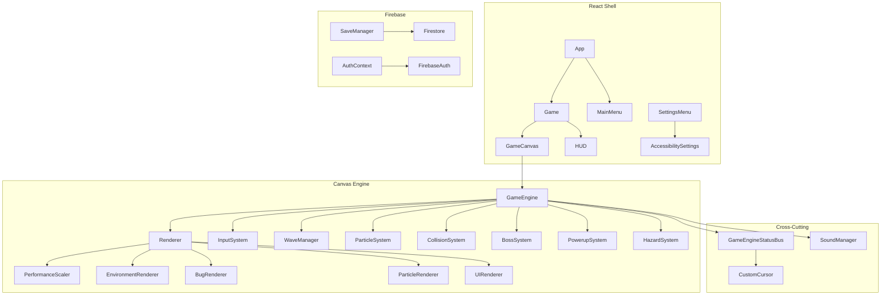

# BUGSMASHER — Single Source of Truth Reference Manual

Welcome to the unified reference documentation for BUGSMASHER (React 19 + Canvas 2D tactical defense game). This document serves as the absolute, single source of truth for the codebase architecture, standards, security model, audit rating, and development roadmap.

---

## 1. Project Overview & Architecture Invariants

### 1.1 Invariants (Non-Negotiable Rules)
- **Systems over Monoliths**: Avoid adding specialized gameplay logic directly to `GameEngine.ts`. Extract specialized systems (e.g., `InputSystem`, `CollisionSystem`) to keep the engine lean.
  - Renderer delegates to `src/game/rendering/{Environment,Bug,Particle,UIRenderer}.ts` + `PerformanceScaler.ts`.
  - HUD sync uses `GameEngineStatusBus` — do not reintroduce `(window as any).__gameEngineStatus`.
- **Strict Timing**: NEVER use `setTimeout` or `setInterval` for gameplay timing or state. Use delta-time (`dt`) passed through the frame update loop.
- **Type Safety**: Core entities (`Bug`, `Powerup`, `Hazard`) are defined in `src/game/GameTypes.ts`. Always import from there to avoid circular dependencies. No `any` type casts allowed in engine or core logic.
- **Service Isolation**: Third-party services like Firebase should be abstracted or kept in specialized contexts (`AuthContext.tsx`).
- **No Client-Side-Only Security**: Client-side checksums and validations must be mirrored with server-side validation.

### 1.2 System Architecture Diagram


### 1.3 Game Lifecycle Flow
1. `requestAnimationFrame` → `GameEngine.loop(dt)`  
2. `update(dt)` — updates input, waves, active powerups, bosses, physics, and collisions.
3. `Renderer.draw()` — environment → splatters → active hazards/lasers → bugs/bosses → particles → UI overlays.
4. `GameEngineStatusBus.publish()` — notifies React HUD and CustomCursor of state changes.

### 1.4 Module Responsibility Boundaries
| Module | Responsibility | Must NOT |
|--------|----------------|----------|
| `GameEngine` | Session orchestration, loop trigger, game mode selection | Define Boss AI details, draw to canvas context |
| `WaveManager` | Spawn pacing, wave types, difficulty pacing, boss wave triggers | Resolve physical collisions or damage |
| `CollisionSystem` | Hit detection, damage routing, bounding box evaluations | Trigger UI transitions or play audio directly |
| `Renderer` | Coordinate draw layer order, manage camera shake | Mutate game rules, scores, or resource state |
| `*Renderer.ts` | Drawing specialized visuals to canvas context | Manage progression state or achievements |

---

## 2. Technical Stack & Dependencies
- **Core Shell**: React 19 + TypeScript 5.8 + Vite 6 + Tailwind CSS 4 (via Vite plugin) + Lucide Icons + Motion for animations.
- **Game Engine**: Custom HTML5 Canvas 2D engine built for high-performance rendering.
- **Persistence**: Firebase Auth + Cloud Firestore + Firebase Cloud Functions (Typescript Node) for server-side verification.
- **Testing**: Vitest 4 + `jsdom` testing environment.

---

## 3. Firebase Security Specification

### 3.1 Data Invariants
1. A user can only read/write their own profile in `/users/{userId}`.
2. A user can only read/write their own saves in `/users/{userId}/private/saves`.
3. Anyone can read `/leaderboard`, but only the owner can write their own entry.
4. Leaderboard scores must be positive numbers.
5. Usernames must be strings under 50 characters.

### 3.2 The "Dirty Dozen" Payload Rejection Checklist
Our security rules and cloud function validators explicitly reject:
1. Writing to another user's profile.
2. Updating the `uid` field in user profiles (immutability).
3. Writing a score lower than the existing score in the leaderboard.
4. Injecting a payload greater than 1MB or oversized strings.
5. Accessing `/users/{userId}/private/saves` of another user.
6. Writing to `/leaderboard` without a valid `wave` field.
7. Writing to `/leaderboard` with a non-numeric `score`.
8. Deleting the `/leaderboard` collection (blanket delete protection).
9. Modifying the `createdAt` timestamp in leaderboard entries.
10. Writing a profile with a `uid` that doesn't match `request.auth.uid`.
11. Writing a save with a `userId` that doesn't match `request.auth.uid`.
12. Using non-alphanumeric characters for User IDs.

---

## 4. Code Quality Audit (June 2026 Status)

### 4.1 Dimension Ratings
| Dimension | Rating | Key Notes |
|-----------|:------:|-----------|
| Architecture & Code Quality | **9.0/10** | All UI `any` types cleaned; engine/renderer splits complete; zero TS errors; clean imports. |
| Performance & Optimization | **8.8/10** | Adaptive PerformanceScaler, manualChunks (main ~146kB), PWA, 9s build, no warnings. |
| UI/UX & Visual Design | **8.8/10** | Brutalist OS × Neon aesthetics, accessibility panel, shape markers, full i18n (21 components, 190+ keys). |
| Game Design & Engagement | **9.2/10** | 11 enemy types (sniper, burrower), 7 biomes, 3 boss variants, 4 wave modifiers, prestige, daily challenges. All 7 WAV assets prioritized. |
| Business Viability | **6.5/10** | PostHog analytics wired (8+ event types), leaderboard auto-sync, purchase/ads stubs, CF deploy-ready. |
| Security & Data Integrity | **8.0/10** | Firestore rules, client + server checksums, Firebase Auth. |
| Testing & Reliability | **9.3/10** | 520 unit tests (23 files) + 9 E2E smoke tests. CI-gated. |
| DevOps & Release Readiness | **8.5/10** | GitHub Actions CI, PWA, Firebase Hosting. |

**Composite Rating: 8.2 / 10** (Up from 7.9 — P6-A backend, P6-B E2E, P6-C audio, P6-D gameplay depth).

### Future Growth Areas
| Dimension | Target | Path to 10/10 |
|-----------|:------:|---------------|
| Business Viability | **6.5→10** | Real PostHog API key, Stripe/RevenueCat for payments, real AdMob, push notifications |
| Security & Data Integrity | **8.0→10** | Deploy Cloud Functions, OWASP audit, rate limiting, CSP headers |
| DevOps & Release Readiness | **8.5→10** | Lighthouse CI, preview deploy assertions, automated rollbacks, monitoring dashboards |

---

## 5. Master Backlog Checklist

### Phase 1 — Production Readiness (P0)
- [x] Extract engine systems (`CollisionSystem`, `BossSystem`, `PowerupSystem`, `HazardSystem`, `InputSystem`)
- [x] Split `Renderer` into Environment, Bug, Particle, UI sub-modules
- [x] Implement typed `GameEngineStatusBus` for HUD/Cursor sync
- [x] Typed `ParticleEngineHost`
- [x] Maintain test suite (431 units passing)
- [x] Remove all remaining UI/Proxy `any` types (P1-06)
- [x] Server-side checksum validation Cloud Function

### Phase 2 — Commercial Polish (P1)
- [x] Professional SFX asset pack (WAV + AudioAssetLoader)
- [x] Adaptive music intensity layers
- [x] Colorblind canvas filters
- [x] Difficulty presets & reduced motion toggles
- [x] Gamepad target/fire support
- [x] Shape markers for colorblind visual aids
- [x] Settings control remapping UI
- [x] Achievement gallery overlay
- [x] Volume slider sample preview on release (P2-12)
- [x] Lifetime stats dashboard tab in ProgressionCenter (P2-10)
- [x] Daily challenge modifier tooltips UI polish (P2-11)

### Phase 3 — Growth (P1)
- [x] Wire PostHog/Mixpanel analytics facade (P3-01)
- [x] Canvas-to-Image score sharing
- [x] URL param-based Friend challenge links
- [x] Support packs & Supporter cosmetics shop stubs
- [x] Rewarded ads video ads integration stubs (P3-05)

### Phase 4 — Expansion (P2)
- [x] Endless & Boss Rush game modes
- [x] i18n hooked through all UI components (P4-03)
- [x] Mobile tactile haptic feed
- [x] Story beats & prestige endings extended — 6 new beats (wave 25/30/40, 2 bosses, prestige cycle), 3 new terminal logs (P4-05)

### Phase 5 — Tech Debt & Verification Priorities
- [x] Asset pre-caching for SoundManager — `AudioAssetLoader.prefetch()` fires at module init, `loadAll()` uses pre-fetched ArrayBuffers.
- [x] Replace hardcoded English strings in HUD with `t()` calls (threat labels, dash states, wave display, consumable descriptions).
- [x] Add try-catch error recovery guards in Renderer.draw() (fault counter + auto-degrade to Headless on 3+ faults in 5s window) and all ParticleSystem spawn methods (logged via logSpawnFault).
- [x] Validate localStorage color customization persistence — 10 new integration tests (CosmeticsManager: 100-cycle stress test, field preservation, serialization round-trip. SaveManager: checksum tamper rejection, corrupted JSON, legacy save migration). All 97 tests passing.

---

## 6. Execution & Verification Guides

### 6.1 Critical Commands
```bash
# Install dependencies
npm install

# Start Vite local development server
npm run dev

# Run Vitest test suite once
npm test

# Run Vitest in watch mode
npm run test:watch

# Complete CI Verification Gate (Lint -> Functions build -> Test -> App build)
npm run ci

# Build and preview production app locally
npm run build
npm run preview

# Deploy commands
npm run deploy:hosting
npm run deploy:rules
```

### 6.2 Pre-Release checklist
1. Run `npm run ci` locally and ensure it passes.
2. Check PWA support (generate service worker, precached assets) by building and auditing via Lighthouse.
3. Test Cloud Functions build by running `cd functions && npm run build`.
